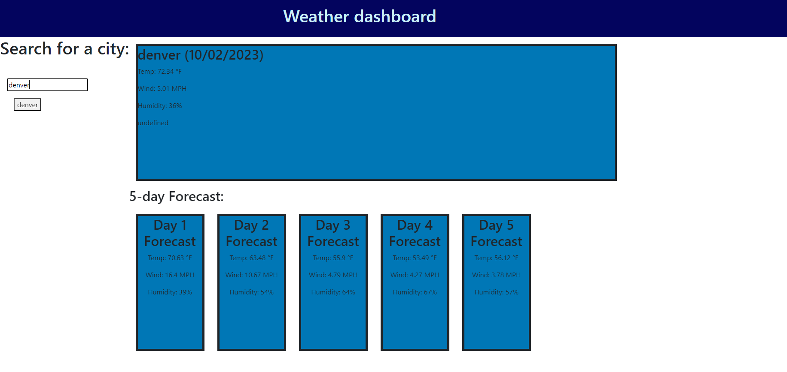

# Weather-dashboard-module6

## Deployed link

https://gmoney3303.github.io/Weather-dashboard-module6/

## Usage

## credits

Weather app api used.
https://api.openweathermap.org/data/2.5/forecast?lat={lat}&lon={lon}&appid={API key}

## Features 

This project features a weather display of a city that you search. It shows current weather and weather over the next five days. After searching a city it is saved to your history and displayed below search. 